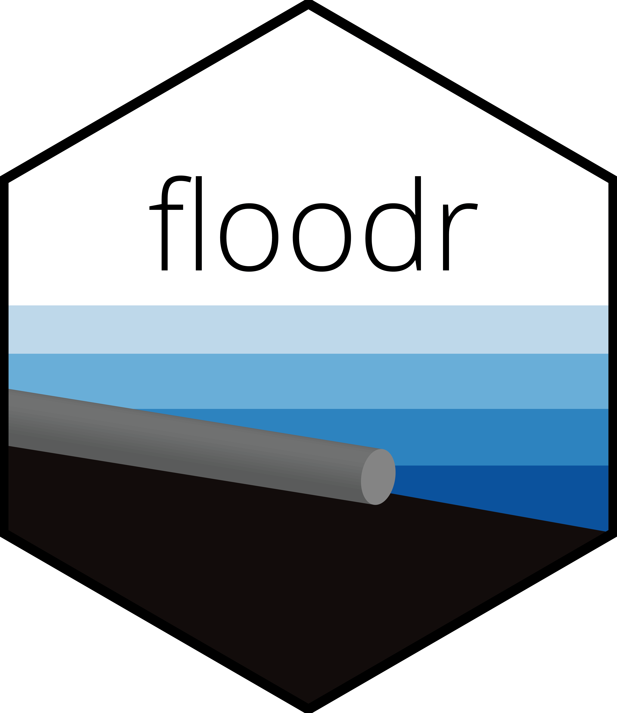

# floodr


High water events such as storm surge, riverine flooding, or high-tide flooding can inundate a stormwater network and reduce its effectiveness. 

`floodr` is an R package that estimates the impacts of downstream flooding on stormwater networks using a minimal amount of data. 

The package `floodr`:

* Models impacts using a **range of water levels** 
* Models impacts using GIS data representing **flooding extents** 
* Estimates various metrics of impact from high water levels on pipes and structures
* Provides multiple visualization functions ranging from plots to interactive maps

`floodr` was designed to be practical and can: 
* Download and process elevation data from NOAA and USGS within R (DEMs & lidar)
* Interpolate missing invert elevations within the stormwater network
* Automatically take care of unit conversions and spatial data projections
* Easily view past results

## Install

Install `floodr` from GitHub using `devtools`:
```R
library(devtools)
install_github("acgold/floodr")
```

## How it works

`floodr` combines spatial representations of the stormwater network and landscape with a 1-dimensional model of the stormwater network. The general workflow is:

1. The spatial data allows for estimates of overland flooding extents.
2. The 1-D model uses the overland flooding extent as a starting point. 
3. The 1-D model then propogates flooding through the stormwater network based on invert elevations and known obstructions (optional).
